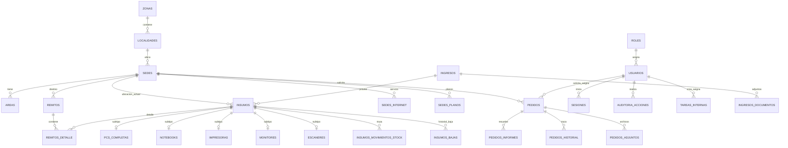

# GUÍA MAESTRA DE MIGRACIÓN: SITIA (PHP Vanilla) ➔ LARAVEL + DOCKER

> **DOCUMENTO TÉCNICO DE REFERENCIA ABSOLUTA**  
> **Sistema:** SITIA (Sistema de Inventario de Telecomunicaciones, Insumos y Administración)  
> **Destino:** Espacio de trabajo nuevo, limpio y desacoplado  
> **Objetivo:** Migración integral con 100% de integridad de datos, cero pérdida de información, paridad funcional exacta y arquitectura escalable en Laravel 11/12 + Docker.

---

## ÍNDICE GENERAL

1. [Filosofía y Reglas de Oro de la Migración](#1-filosofía-y-reglas-de-oro-de-la-migración)
2. [Arquitectura Tecnológica Objetivo (Docker + Laravel)](#2-arquitectura-tecnológica-objetivo-docker--laravel)
3. [Blueprint de Infraestructura Docker](#3-blueprint-de-infraestructura-docker)
4. [Esquema Completo de Base de Datos y Relaciones](#4-esquema-completo-de-base-de-datos-y-relaciones)
5. [Lógica de Negocio Crítica y Casos Borde (The Core Logic)](#5-lógica-de-negocio-crítica-y-casos-borde-the-core-logic)
6. [Seguridad, Roles, Permisos y Auditoría Forense](#6-seguridad-roles-permisos-y-auditoría-forense)
7. [Motor de Reportes PDF con Fidelidad Píxel por Píxel](#7-motor-de-reportes-pdf-con-fidelidad-píxel-por-píxel)
8. [Frontend, DataTables SSP y Sistema de Diseño](#8-frontend-datatables-ssp-y-sistema-de-diseño)
9. [Catálogo de Endpoints y Rutas](#9-catálogo-de-endpoints-y-rutas)
10. [Gestión de Archivos Adjuntos (/uploads/)](#10-gestión-de-archivos-adjuntos-uploads)
11. [Runbook Paso a Paso de Ejecución en Espacio Limpio](#11-runbook-paso-a-paso-de-ejecución-en-espacio-limpio)
12. [Matriz de Verificación y Pruebas de Aceptación](#12-matriz-de-verificación-y-pruebas-de-aceptación)

---

## 1. FILOSOFÍA Y REGLAS DE ORO DE LA MIGRACIÓN

1. **Intocabilidad de los Datos Históricos:**  
   Los IDs autoincrementales, UUIDs, números de serie, fechas y relaciones entre remitos, insumos y usuarios NO deben reinicializarse ni modificarse. La base de datos actual contiene el inventario real y remitos legalmente válidos.
2. **Cero Comandos Destructivos:**  
   Comandos como `php artisan migrate:fresh` o `migrate:refresh` están TERMINANTEMENTE PROHIBIDOS en ambientes con datos reales.
3. **Paridad de Comportamiento:**  
   El usuario final no debe notar diferencias operativas: los remitos deben seguir generándose con formato `0001_YYYY`, el stock dual de tipo Varios debe responder con la misma lógica, y las tablas DataTables deben preservar sus páginas y filtros.
4. **Desacoplamiento Total:**  
   Este proceso se realiza en un repositorio y espacio de trabajo independiente para garantizar que la aplicación en producción actual continúe operativa e intacta durante todo el desarrollo.

---

## 2. ARQUITECTURA TECNOLÓGICA OBJETIVO (DOCKER + LARAVEL)

* **Framework:** Laravel 11.x o 12.x (PHP 8.3-FPM).
* **Servidor Web:** Nginx 1.25+ Alpine (reverse proxy y servido de estáticos).
* **Motor de Base de Datos:** **MariaDB 10.11 LTS** (100% compatible con los dumps y sintaxis del `10.4.32-MariaDB` actual).
* **Cache, Sesiones y Colas:** Redis 7.x Alpine.
* **Empaquetado Frontend:** Vite (Bootstrap 5.3, DataTables 1.13+, FontAwesome 6, Select2, Chart.js).
* **Generación PDF:** FPDI (`setasign/fpdi`) + TCPDF (`tecnickcom/tcpdf`) para respetar la importación de `membretada.pdf`.

---

## 3. BLUEPRINT DE INFRAESTRUCTURA DOCKER

### 3.1. `docker-compose.yml`
```yaml
version: '3.8'

services:
  app:
    build:
      context: .
      dockerfile: docker/php/Dockerfile
    container_name: sitia-app
    restart: unless-stopped
    working_dir: /var/www/html
    volumes:
      - ./:/var/www/html
      - sitia_uploads:/var/www/html/storage/app/public/uploads
    networks:
      - sitia-network
    depends_on:
      - db
      - redis

  web:
    image: nginx:alpine
    container_name: sitia-web
    restart: unless-stopped
    ports:
      - "8080:80"
    volumes:
      - ./:/var/www/html
      - ./docker/nginx/vhost.conf:/etc/nginx/conf.d/default.conf:ro
      - sitia_uploads:/var/www/html/storage/app/public/uploads:ro
    networks:
      - sitia-network
    depends_on:
      - app

  db:
    image: mariadb:10.11
    container_name: sitia-db
    restart: unless-stopped
    environment:
      MYSQL_ROOT_PASSWORD: ${DB_ROOT_PASSWORD:-root_secret}
      MYSQL_DATABASE: ${DB_DATABASE:-inventario_insumos_v1}
      MYSQL_USER: ${DB_USERNAME:-sitia_user}
      MYSQL_PASSWORD: ${DB_PASSWORD:-sitia_pass}
      TZ: America/Argentina/Buenos_Aires
    command: >
      --default-authentication-plugin=mysql_native_password
      --character-set-server=utf8mb4
      --collation-server=utf8mb4_general_ci
      --default-time-zone='-03:00'
    volumes:
      - sitia_db_data:/var/lib/mysql
      - ./docker/mariadb/init:/docker-entrypoint-initdb.d:ro
    ports:
      - "3307:3306"
    networks:
      - sitia-network

  redis:
    image: redis:alpine
    container_name: sitia-redis
    restart: unless-stopped
    volumes:
      - sitia_redis_data:/data
    networks:
      - sitia-network

networks:
  sitia-network:
    driver: bridge

volumes:
  sitia_db_data:
  sitia_uploads:
  sitia_redis_data:
```

### 3.2. `docker/php/Dockerfile`
```dockerfile
FROM php:8.3-fpm-alpine

# Instalar dependencias del sistema
RUN apk add --no-cache \
    curl \
    git \
    libpng-dev \
    libxml2-dev \
    libzip-dev \
    zip \
    unzip \
    freetype-dev \
    libjpeg-turbo-dev \
    oniguruma-dev \
    icu-dev \
    shadow

# Configurar e instalar extensiones PHP requeridas por SITIA y Laravel
RUN docker-php-ext-configure gd --with-freetype --with-jpeg \
    && docker-php-ext-install -j$(nproc) \
        pdo_mysql \
        mbstring \
        exif \
        pcntl \
        bcmath \
        gd \
        zip \
        intl \
        opcache

# Instalar extensión de Redis
RUN apk add --no-cache --virtual .build-deps $PHPIZE_DEPS \
    && pecl install redis \
    && docker-php-ext-enable redis \
    && apk del .build-deps

# Instalar Composer
COPY --from=composer:2 /usr/bin/composer /usr/bin/composer

# Configurar usuario del sistema (evitar problemas de permisos de archivos)
RUN usermod -u 1000 www-data && groupmod -g 1000 www-data

WORKDIR /var/www/html

USER www-data

EXPOSE 9000
CMD ["php-fpm"]
```

### 3.3. `docker/nginx/vhost.conf`
```nginx
server {
    listen 80;
    server_name localhost;
    root /var/www/html/public;
    index index.php index.html;

    client_max_body_size 64M;

    location / {
        try_files $uri $uri/ /index.php?$query_string;
    }

    # Acceso directo y eficiente a uploads persistidos
    location /storage/uploads/ {
        alias /var/www/html/storage/app/public/uploads/;
        access_log off;
        expires max;
    }

    location ~ \.php$ {
        fastcgi_pass app:9000;
        fastcgi_index index.php;
        fastcgi_param SCRIPT_FILENAME $document_root$fastcgi_script_name;
        include fastcgi_params;
        fastcgi_buffer_size 128k;
        fastcgi_buffers 4 256k;
        fastcgi_busy_buffers_size 256k;
        fastcgi_read_timeout 300;
    }

    location ~ /\.(?!well-known).* {
        deny all;
    }
}
```

### 3.4. Soporte para Entornos detrás de Proxy Corporativo / Red de Gobierno (Intranet 10.x.x.x)
En redes institucionales y gubernamentales (como la red `10.114.85.21`), los servidores suelen salir a internet a través de un proxy corporativo. Para que la construcción de contenedores (`docker build`) y la descarga de dependencias (`composer`, `apk`, `npm`) funcionen sin bloqueos:

1. **Configuración en `docker-compose.yml`:**
   ```yaml
   services:
     app:
       build:
         context: .
         dockerfile: docker/php/Dockerfile
         args:
           HTTP_PROXY: ${HTTP_PROXY:-}
           HTTPS_PROXY: ${HTTPS_PROXY:-}
           NO_PROXY: ${NO_PROXY:-localhost,127.0.0.1,sitia-web,sitia-db,sitia-redis}
       environment:
         - HTTP_PROXY=${HTTP_PROXY:-}
         - HTTPS_PROXY=${HTTPS_PROXY:-}
         - NO_PROXY=${NO_PROXY:-localhost,127.0.0.1,sitia-web,sitia-db,sitia-redis}
   ```
2. **Estrategia "Offline Bundle" (Recomendada si el proxy bloquea descargas):**
   * El proyecto actual ya contiene todas las librerías frontend empaquetadas localmente en `public/vendor/`.
   * En Laravel, estas carpetas se copian directamente a `public/vendor/` o se empaquetan en el repositorio, eliminando cualquier dependencia de conexión a internet para levantar el frontend.

### 3.5. Configuración de Trusted Proxies en Laravel 11/12 (Crítico para IP 10.x.x.x)
Cuando SITIA corre detrás de Nginx, balanceadores de carga o proxies reversos de la infraestructura provincial, Laravel debe confiar en las cabeceras `X-Forwarded-*` para que funciones como `url()`, `asset()`, `route()` y las redirecciones generen la URL real del cliente (`http://10.114.85.21/...`) y no `http://localhost`:

**Configuración en `bootstrap/app.php` (Laravel 11/12):**
```php
use Illuminate\Http\Request;

return Application::configure(basePath: dirname(__DIR__))
    // ...
    ->withMiddleware(function (Middleware $middleware) {
        // Confiar en todos los proxies inversos de la red interna
        $middleware->trustProxies(at: '*');
        $middleware->trustProxies(headers: Request::HEADER_X_FORWARDED_FOR |
            Request::HEADER_X_FORWARDED_HOST |
            Request::HEADER_X_FORWARDED_PORT |
            Request::HEADER_X_FORWARDED_PROTO |
            Request::HEADER_X_FORWARDED_AWS_ELB
        );
    })
    // ...
```

---

## 4. ESQUEMA COMPLETO DE BASE DE DATOS Y RELACIONES

La base de datos actual contiene **43 tablas y 1 vista**. A continuación se detalla la estructura física, llaves foráneas y particularidades:



### 4.1. Catálogo Completo de Tablas

#### A. Módulo Insumos e Inventario
1. **`insumos`** (Tabla Maestra del Inventario)
   - `id_insumo` (PK, INT Auto)
   - `nombre_insumo` (VARCHAR 100)
   - `tipo_insumo` (ENUM: `'Varios','PC Escritorio','Notebook','Impresora','Monitor','Escaner'`)
   - `subcategoria_varios` (ENUM: `'Hardware','Periféricos','Red'`, NULL si no es Varios)
   - `descripcion_general` (VARCHAR 255)
   - `numero_serie` (VARCHAR 50, opcional)
   - `id_fisico` (VARCHAR 50, formato limpio sin guiones)
   - `id_patrimonio` (VARCHAR 50)
   - `cantidad` (INT, default 1)
   - `cantidad_oficina` (INT, stock disponible oficina para Varios)
   - `cantidad_deposito` (INT, stock reserva depósito para Varios)
   - `fecha_adquisicion` (DATE)
   - `estado` (ENUM: `'Disponible','Asignado','De Baja'`)
   - `id_punto_stock_actual` (FK `puntos_stock`, NULL)
   - `id_sede_actual` (FK `sedes`, NULL)
   - `id_area_asignacion_actual` (FK `areas`, NULL)
   - `id_ingreso` (FK `ingresos`, NULL)
   - `es_nuevo` (TINYINT 1, 1=Nuevo, 0=Usado)
   - `id_patrimonio_idx` (**VIRTUAL GENERATED**: `case when tipo_insumo <> 'Varios' then id_patrimonio else NULL end`, UNIQUE).
2. **`pcs_completas`** (Subtabla 1:1 con `insumos`)
   - `id_pc_completa` (PK)
   - `id_insumo` (FK `insumos`, UNIQUE)
   - `procesador`, `ram_gb`, `almacenamiento_gb`, `mother`, `sist_op`
   - `ssd_o_superior` (TINYINT 1)
   - `almacenamiento_secundario_gb`, `ssd_secundario` (TINYINT 1)
3. **`notebooks`** (Subtabla 1:1 con `insumos`)
   - `id_notebook` (PK)
   - `id_insumo` (FK `insumos`, UNIQUE)
   - `marca`, `modelo`, `procesador`, `ram_gb`, `almacenamiento_gb`, `ssd_o_superior`
   - Accesorios: `cargador`, `funda`, `micro_sd`, `micro_sd_gb`, `caja`, `adaptador_red` (TINYINT 1)
4. **`impresoras`** (Subtabla 1:1 con `insumos`)
   - `id_impresora` (PK), `id_insumo` (FK UNIQUE), `marca`, `modelo`
5. **`monitores`** (Subtabla 1:1 con `insumos`)
   - `id_monitor` (PK), `id_insumo` (FK UNIQUE), `marca`, `modelo`, `pulgadas` (DECIMAL 4,1), `conexion` (ENUM: `'VGA','HDMI','Ambas'`)
6. **`escaneres`** (Subtabla 1:1 con `insumos`)
   - `id_escaner` (PK), `id_insumo` (FK UNIQUE), `marca`, `modelo`
7. **`insumos_movimientos_stock`**: Historial de ajustes manuales y reposiciones de stock entre oficina y depósito.
8. **`insumos_bajas`**: Registro histórico de bajas de insumos (motivo, fecha, usuario responsable).
9. **`opciones_almacenamiento`**: Catálogo de capacidades de disco (32GB, 256GB, 512GB, 1TB, etc.).
10. **`puntos_stock`**: Puntos físicos de almacenamiento (Stock Central, Depósito, etc.).
11. **`ingresos`** e **`ingresos_documentos`**: Licitaciones, órdenes de compra y documentos PDF asociados a lotes de insumos.

#### B. Módulo Asignaciones y Remitos
12. **`remitos`**
    - `id_remito` (PK), `numero_remito` (VARCHAR 50, UNIQUE, formato `0001_YYYY`)
    - `id_sede` (FK), `id_area` (FK, NULL)
    - `nombre_persona_asignada`, `apellido_persona_asignada`, `fecha_asignacion`
    - `estado` (ENUM: `'Activa','Devuelta','Anulado'`)
    - `fecha_devolucion`, `observaciones`, `motivo_anulacion`, `fecha_anulacion`
    - Archivos: `declaracion_jurada`, `nota_solicitud`, `remito_firmado`
13. **`remitos_detalle`**
    - `id_detalle` (PK), `id_remito` (FK), `id_insumo` (FK)
    - `cantidad` (INT, default 1)
    - `cantidad_devuelta` (INT, default 0)
14. **`remito_secuencia`**
    - `anio` (INT, PK), `ultimo` (INT). Control de numeración atómica.
15. **`remitos_historicos_secuencia`**: Compatibilidad con secuencias heredadas.

#### C. Módulo Pedidos y Tareas Técnicas
16. **`pedidos`**: Solicitudes de soporte o insumos. Estados: `'Pendiente','En Proceso','Preparado','Completado','Rechazado','Sin Stock'`.
17. **`pedidos_historial`**: Trazabilidad de cambios de estado y comentarios.
18. **`pedidos_adjuntos`**: Archivos adjuntos a pedidos.
19. **`pedidos_informes`**: Informes técnicos de resolución vinculados a pedidos.
20. **`pedidos_informes_secuencia`**: Numerador de informes técnicos (`anio`, `ultimo_numero`).
21. **`tareas_internas`**: Tareas exclusivas del área técnica.
22. **`tareas_comentarios`**: Comentarios de avance en tareas internas.

#### D. Módulo Geográfico y Telecomunicaciones
23. **`zonas`**, **`localidades`**, **`sedes`**, **`areas`**, **`sede_areas`**.
24. **`sedes_internet`**: Proveedor, tipo de conexión, velocidad, estado (`Activo`, `Pendiente`, `De Baja`, `Baja por Traslado`), trazabilidad de traslados (`id_servicio_trasladado_a` / `desde`).
25. **`sedes_internet_tests`**: Tests de velocidad (Speedtest) registrados por sede.
26. **`sedes_telefonia_lineas`**, **`sedes_vigilancia`**, **`sedes_vigilancia_dispositivos`**, **`sedes_red_dispositivos`**.
27. **`sedes_planos`**: Planos edilicios/red/vigilancia de cada sede.

#### E. Módulo de Seguridad y Sistema
28. **`usuarios`**: `id_usuario`, `username`, `email`, `password_hash`, `nombre`, `apellido`, `id_rol`, `permisos_personalizados` (JSON), `activo`, `ultimo_acceso`.
29. **`roles`**: `id_rol`, `nombre_rol`, `permisos` (JSON).
30. **`sesiones`**: Control de sesión única activa por usuario con `token_sesion`.
31. **`auditoria_acciones`**: Registro forense de acciones con snapshots JSON `datos_antes` y `datos_despues`.
32. **`notificaciones`**: Notificaciones del sistema a usuarios.

---

## 5. LÓGICA DE NEGOCIO CRÍTICA Y CASOS BORDE (THE CORE LOGIC)

Esta sección contiene la lógica más sensible del sistema, la cual **debe implementarse mediante Clases de Servicio en Laravel** (`App\Services\...`).

### 5.1. Generación Concurrente de Números de Remito (`RemitoService`)
Los números de remito tienen el formato estricto `0001_YYYY`. Nunca deben duplicarse ni saltearse, incluso bajo peticiones simultáneas.

**Implementación requerida en Laravel:**
```php
namespace App\Services;

use Illuminate\Support\Facades\DB;
use Exception;

class RemitoSequenceService
{
    public function obtenerSiguienteNumero(): string
    {
        $anio = (int) now()->format('Y');

        return DB::transaction(function () use ($anio) {
            // Asegurar que exista la fila para el año actual
            DB::statement("
                INSERT INTO remito_secuencia (anio, ultimo) 
                VALUES (?, 0) 
                ON DUPLICATE KEY UPDATE ultimo = ultimo
            ", [$anio]);

            // Bloqueo pesimista FOR UPDATE
            $secuencia = DB::table('remito_secuencia')
                ->where('anio', $anio)
                ->lockForUpdate()
                ->first();

            $siguiente = ($secuencia->ultimo ?? 0) + 1;

            DB::table('remito_secuencia')
                ->where('anio', $anio)
                ->update(['ultimo' => $siguiente]);

            return sprintf('%04d_%d', $siguiente, $anio);
        });
    }
}
```

### 5.2. Mecánica de Stock Dual para Tipo "Varios"
El tipo de insumo "Varios" tiene una lógica bifásica única:
1. **En Stock Disponible:**
   * El insumo tiene `cantidad_oficina` y `cantidad_deposito`.
   * La `cantidad` total en stock es `cantidad_oficina + cantidad_deposito`.
   * Solo el stock de oficina puede ser asignado inmediatamente. Si se necesita más, el operador debe ejecutar una "Reposición" (`reponer_stock_oficina`), lo que descuenta de depósito, suma a oficina y genera un registro en `insumos_movimientos_stock`.
2. **Al Crear Remito (Asignación):**
   * Se descuenta la cantidad asignada de `cantidad_oficina`.
   * En `remitos_detalle` se guarda `cantidad` asignada y `cantidad_devuelta = 0`.
   * Si `cantidad_oficina + cantidad_deposito == 0`, el estado del insumo pasa a `Asignado`.
3. **Al Devolver Insumo desde Remito:**
   * La devolución incrementa `cantidad_devuelta` en `remitos_detalle`.
   * La cantidad devuelta se reincorpora a `cantidad_oficina` del insumo.
   * Si el insumo estaba en `Asignado`, vuelve a `Disponible`.
4. **Vistas DataTables:**
   * Pestaña **Disponibles**: Muestra el insumo agrupado por `id_insumo` con badges desglosados (Oficina, Depósito, Total).
   * Pestaña **Asignados**: Se expande por asignación (`GROUP BY i.id_insumo, r.id_remito`), mostrando a qué persona y remito particular está asignada esa fracción.

### 5.3. Validación Estricta de Unicidad de Insumos (`InsumoValidationService`)
Reglas de unicidad para evitar equipos duplicados:
1. **`numero_serie`**: Único en toda la tabla si no es nulo/vacío.
2. **`id_fisico`**: Se debe sanitizar eliminando guiones y espacios:
   ```php
   $idLimpio = strtoupper(str_replace(['-', ' '], '', trim($idFisico)));
   ```
   Se compara contra `REPLACE(REPLACE(id_fisico, '-', ''), ' ', '')`.
3. **`id_patrimonio`**: Único para todos los tipos EXCEPTO 'Varios' (controlado por la columna virtual `id_patrimonio_idx` y validado a nivel de FormRequest).

---

## 6. SEGURIDAD, ROLES, PERMISOS Y AUDITORÍA FORENSE

### 6.1. Hashing de Contraseñas
SITIA utiliza el algoritmo estándar de PHP `password_hash($pass, PASSWORD_BCRYPT)`.  
Laravel utiliza BCrypt por defecto en su facade `Hash::check()`. **Las contraseñas de los usuarios migrados funcionarán inmediatamente sin necesidad de reseteo.**

### 6.2. Sistema de Permisos RBAC
SITIA maneja permisos en JSON estructurados por módulo y acción:
```json
{
  "insumos": ["ver", "crear", "editar", "eliminar", "baja"],
  "asignaciones": ["ver", "crear", "editar", "anular", "devolver"],
  "pedidos": ["ver_propios", "ver_todos", "crear", "gestionar", "asignar", "informe", "eliminar"],
  "telecom": ["ver", "crear", "editar", "eliminar"],
  "usuarios": ["ver", "crear", "editar", "eliminar", "cambiar_rol"],
  "reportes": ["ver", "generar"]
}
```

* **Prioridad de evaluación:** Si `usuarios.permisos_personalizados` no es nulo, tiene precedencia absoluta sobre `roles.permisos`.
* **Implementación en Laravel:** Se debe crear un `Gate::before` o Middleware `CheckPermission:modulo,accion`:
```php
Gate::define('permiso', function (User $user, string $modulo, string $accion) {
    return $user->tienePermiso($modulo, $accion);
});
```

### 6.3. Auditoría Forense Automática (Observer / Trait)
Toda modificación sensible debe dejar traza en `auditoria_acciones`:
* `id_usuario`
* `accion` (`crear_insumo`, `editar_insumo`, etc.)
* `modulo` (`insumos`, `asignaciones`, etc.)
* `datos_antes` (JSON con el estado previo del modelo)
* `datos_despues` (JSON con el nuevo estado)
* `ip_address` y `user_agent`

---

## 7. MOTOR DE REPORTES PDF CON FIDELIDAD PÍXEL POR PÍXEL

El sistema cuenta con reportes oficiales que deben conservarse idénticos:

### 7.1. Remitos Oficiales con Hoja Membretada (`RemitoPdfService`)
* **Librería requerida:** `setasign/fpdi` + `tecnickcom/tcpdf`.
* **Archivo base:** `membretada.pdf` (ubicado en la raíz de assets).
* **Mecánica:** FPDI abre `membretada.pdf`, importa la página 1 como plantilla de fondo (`useTemplate`), y escribe los datos del remito encima respetando márgenes y coordenadas milimétricas exactas (offset superior de 30mm para librar el escudo oficial).

### 7.2. Planillas de Relevamiento (`RelevamientoPdfService`)
* Formatos soportados:
  * **2x2 Insumos** (4 tarjetas por hoja A4, 2 filas x 2 columnas).
  * **2x1 Insumos** (2 tarjetas a lo alto).
  * **2x2 Combinado** (2 tarjetas de Insumos arriba + 2 tarjetas de Notebooks abajo).
* El motor dibuja celdas, bordes y checkboxes con milímetros precisos (`$pdf->Rect()`, `$pdf->SetXY()`). No debe traducirse a HTML/CSS para evitar saltos de página erráticos.

---

## 8. FRONTEND, DATATABLES SSP Y SISTEMA DE DISEÑO

### 8.1. DataTables Server-Side Processing (SSP)
La tabla principal de insumos y asignaciones maneja miles de registros y utiliza Server-Side Processing:
* **Protocolo estricto:** Respuesta JSON con `draw`, `recordsTotal`, `recordsFiltered` y `data`.
* **Offset inicial (DataTables 1.13.x):**
  ```javascript
  dtOptions.iDisplayStart = targetPage * pLen;
  dtOptions.displayStart = targetPage * pLen;
  ```
* **Preservación de página y foco:**
  * Al editar una fila, se envía `&dt_page=X`. Al retornar, la tabla carga en esa página, ejecuta el `drawCallback`, aplica scroll suave al insumo y activa la animación:
  ```css
  .row-highlight-active {
      animation: highlightFade 3.5s ease-out forwards;
  }
  ```

### 8.2. Sistema de Diseño y Modo Oscuro
* El proyecto utiliza **Bootstrap 5.3** con personalizaciones en `public/css/style.css`.
* **Modo Oscuro:** Se controla mediante el atributo `data-theme="dark"` en la etiqueta `<html>`, persistido en `localStorage.getItem('sitia_theme')`.
* En Laravel, el layout maestro Blade (`layouts/app.blade.php`) debe incluir el script inline en el `<head>` para evitar parpadeos blancos durante la carga de página:
```html
<script>
    (function() {
        const theme = localStorage.getItem('sitia_theme') || 'light';
        document.documentElement.setAttribute('data-theme', theme);
    })();
</script>
```

### 8.3. Política Estricta de Librerías 100% Offline (Cero CDNs Externas)
En la red provincial e institucional (`10.114.85.21`), los clientes y puestos de trabajo navegan a través de proxies restrictivos que bloquean conexiones a dominios externos. Por este motivo:
* **TERMINANTEMENTE PROHIBIDO usar CDNs externas** como `cdnjs.cloudflare.com`, `cdn.jsdelivr.net`, `unpkg.com` o Google Fonts.
* **Librerías locales preempaquetadas:** Todas las dependencias visuales de SITIA residen dentro de `public/vendor/`:
  - `public/vendor/bootstrap/` (CSS + JS bundle)
  - `public/vendor/fontawesome/` (CSS + Webfonts woff2 locales)
  - `public/vendor/datatables/` (JS core + Bootstrap 5 styling)
  - `public/vendor/jquery/` (jQuery 3.7.0 minificado)
  - `public/vendor/select2/` (CSS + JS + tema Bootstrap 5)
  - `public/vendor/chartjs/` (Chart.js bundle local para dashboard)
  - `public/vendor/xlsx/` (SheetJS local para exportaciones Excel)
* **En Laravel:** Estas librerías se copian directamente a `public/vendor/` en el proyecto o se compilan vía Vite sin enlaces externos, asegurando que la aplicación cargue de inmediato sin requerir salida a internet y sin ser bloqueada por firewalls o proxies de navegación.

---

## 9. CATÁLOGO DE ENDPOINTS Y RUTAS

### 9.1. Mapeo de Vistas (`pages/` ➔ Laravel Routes / Controllers)

| Archivo Legado | Ruta Laravel Propuesta | Controlador | Acción |
|---|---|---|---|
| `pages/dashboard.php` | `/` y `/dashboard` | `DashboardController` | `index` |
| `pages/insumos/listar.php` | `/insumos` | `InsumoController` | `index` |
| `pages/insumos/agregar_nueva.php` | `/insumos/crear` | `InsumoController` | `create` / `store` |
| `pages/insumos/editar.php` | `/insumos/{id}/editar` | `InsumoController` | `edit` / `update` |
| `pages/insumos/ver.php` | `/insumos/{id}` | `InsumoController` | `show` |
| `pages/insumos/movimientos.php` | `/insumos/movimientos` | `InsumoMovimientoController` | `index` |
| `pages/insumos/intervenidos.php` | `/insumos/intervenidos` | `InsumoController` | `intervenidos` |
| `pages/insumos/ingresos_listar.php` | `/ingresos` | `IngresoController` | `index` |
| `pages/asignaciones/listar.php` | `/asignaciones` | `RemitoController` | `index` |
| `pages/asignaciones/nueva_pasos.php` | `/asignaciones/crear` | `RemitoController` | `create` / `store` |
| `pages/pedidos/listar.php` | `/pedidos` | `PedidoController` | `index` |
| `pages/pedidos/nuevo_pedido.php` | `/pedidos/crear` | `PedidoController` | `create` / `store` |
| `pages/pedidos/ver.php` | `/pedidos/{id}` | `PedidoController` | `show` |
| `pages/pedidos/editar_tarea_interna.php`| `/tareas/{id}` | `TareaInternaController` | `edit` / `update` |
| `pages/admin/telecom_resumen.php` | `/telecom` | `TelecomController` | `index` |
| `pages/admin/telecom_internet.php` | `/telecom/internet` | `TelecomInternetController`| `index` |
| `pages/admin/usuarios/listar.php` | `/admin/usuarios` | `UsuarioController` | `index` |
| `pages/admin/auditoria.php` | `/admin/auditoria` | `AuditoriaController` | `index` |

### 9.2. Mapeo de Endpoints AJAX (`ajax/` ➔ Laravel API/Web Routes)

* `ajax/insumos_list_ssp.php` ➔ `GET /ajax/insumos/datatable` (`InsumoDatatableController`)
* `ajax/remitos_list_ssp.php` ➔ `GET /ajax/remitos/datatable`
* `ajax/pedidos_list_ssp.php` ➔ `GET /ajax/pedidos/datatable`
* `ajax/auditoria_list_ssp.php` ➔ `GET /ajax/auditoria/datatable`
* `ajax/validar_insumo_unico.php` ➔ `POST /ajax/insumos/validar-unico`
* `ajax/devolver_insumos.php` ➔ `POST /ajax/asignaciones/devolver`
* `ajax/reponer_stock_oficina.php` ➔ `POST /ajax/insumos/reponer-stock`
* `ajax/cargar_sedes.php` ➔ `GET /ajax/localidades/{id}/sedes`
* `ajax/areas_por_sede.php` ➔ `GET /ajax/sedes/{id}/areas`
* `ajax/busqueda_global.php` ➔ `GET /ajax/busqueda-global`

---

## 10. GESTIÓN DE ARCHIVOS ADJUNTOS (/uploads/)

En el proyecto actual, todos los archivos subidos residen en `/uploads/`:
```
uploads/
├── documentos/        # Declaraciones juradas de notebooks y notas
├── ingresos/          # Remitos y facturas de licitaciones
├── pedidos/           # Adjuntos de pedidos de soporte
├── planos/            # Planos de sedes (PDF, JPG, PNG - SVG prohibido)
├── remitos_firmados/  # PDFs de remitos escaneados con firma ológrafa
├── tareas/            # Adjuntos de tareas internas
└── telecom/           # PDFs de autorización de internet y traslados
```

### Regla de Migración de Archivos
1. En Laravel, la carpeta `uploads` se ubicará en `storage/app/public/uploads/`.
2. Se ejecutará `php artisan storage:link`.
3. El volumen persistente de Docker mapeará directamente dicha carpeta.
4. **Validación de archivos (Service):**
   * Documentos generales: PDF, DOC, DOCX, XLS, XLSX (máx 15MB).
   * Planos: PDF, DWG, DXF, PNG, JPG (SVG prohibido por vectores XSS).
   * Firmas / DJs: Solo PDF estricto (máx 10MB).

---

## 11. RUNBOOK PASO A PASO DE EJECUCIÓN EN ESPACIO LIMPIO

Sigue esta secuencia exacta cuando estés en el nuevo directorio de trabajo:

### Paso 1: Preparación del Entorno
1. Crear el nuevo directorio de proyecto (ej: `/opt/sitia_laravel`).
2. Clonar o inicializar repositorio Git vacío.
3. Copiar los archivos Docker (`Dockerfile`, `docker-compose.yml`, configs de Nginx).
4. Levantar los contenedores: `docker compose up -d --build`.

### Paso 2: Instalación de Laravel
1. Entrar al contenedor app: `docker compose exec app sh`.
2. Crear proyecto Laravel: `composer create-project laravel/laravel .`.
3. Instalar librerías complementarias:
   ```bash
   composer require setasign/fpdi tecnickcom/tcpdf
   ```

### Paso 3: Migración e Importación de Base de Datos
1. Exportar la base de producción actual sin bloqueos:
   ```bash
   /opt/lampp/bin/mysqldump -u joaquin -p12345678 --single-transaction --routines --triggers inventario_insumos_v1 > /copia_segura/sitia_prod_backup.sql
   ```
2. Importar el dump dentro del contenedor MariaDB:
   ```bash
   docker compose exec -T db mysql -u sitia_user -psitia_pass inventario_insumos_v1 < /copia_segura/sitia_prod_backup.sql
   ```
3. Generar migraciones en Laravel que mapeen el esquema existente.

### Paso 4: Migración de Archivos Estáticos y Assets
1. Copiar `membretada.pdf` al directorio `resources/pdf/membretada.pdf`.
2. Copiar todo el contenido de `/uploads/` a `storage/app/public/uploads/`.
3. Ejecutar `php artisan storage:link`.
4. Importar `style.css` en la estructura de Vite.

### Paso 5: Implementación de Modelos y Lógica
1. Crear Modelos Eloquent (`Insumo`, `Remito`, `Pedido`, `Usuario`, etc.) respetando nombres de tablas y llaves primarias.
2. Implementar los Servicios (`RemitoSequenceService`, `InsumoValidationService`, `PdfService`).
3. Crear Controladores y Rutas replicando los catálogos del punto 9.

---

## 12. MATRIZ DE VERIFICACIÓN Y PRUEBAS DE ACEPTACIÓN

Antes de dar por finalizada la migración, se deben verificar positivamente los siguientes 10 puntos de control:

| # | Prueba de Aceptación | Resultado Esperado |
|---|---|---|
| 1 | **Login con Usuario Existente** | El usuario inicia sesión exitosamente con su contraseña actual de producción. |
| 2 | **Control de Sesión Única** | Iniciar sesión en un segundo navegador cierra automáticamente la sesión anterior. |
| 3 | **Carga DataTables Insumos** | La tabla carga por AJAX con paginación server-side, orden y filtros funcionando. |
| 4 | **Edición y Foco en Página 4** | Al editar un insumo en la página 4, retorna a la página 4 con la fila resaltada en amarillo y scroll centrado. |
| 5 | **Generación de Remito** | El nuevo remito toma exactamente el correlativo siguiente en formato `0001_YYYY`. |
| 6 | **Stock Dual Varios** | Asignar un insumo tipo Varios descuenta solo de oficina; devolverlo restaura la oficina. |
| 7 | **Generación PDF Remito** | El PDF descargado contiene la hoja membretada oficial de fondo con textos alineados al milímetro. |
| 8 | **Planilla Relevamiento** | La planilla 2x2 encaja perfectamente en una hoja A4 sin desbordar a una segunda hoja. |
| 9 | **Auditoría Forense** | Cada edición crea un registro en `auditoria_acciones` con el JSON de antes y después. |
| 10| **Modo Oscuro** | El toggle cambia el tema instantáneamente y se preserva al recargar la página. |

---

## 13. COMPENDIO HISTÓRICO DE PROBLEMAS RESUELTOS Y LECCIONES APRENDIDAS (2025 - 2026)

Esta sección recopila **todos los problemas reales, errores de producción, incidentes de red, casos borde y decisiones de diseño resueltos a lo largo de más de 30 ciclos de desarrollo e incidentes en el último año** en SITIA. El nuevo desarrollo en Laravel + Docker debe incorporar cada una de estas soluciones desde el primer día para evitar reintroducir bugs ya superados.

```
┌────────────────────────────────────────────────────────────────────────┐
│             MAPA DE APRENDIZAJES Y LECCIONES DE PRODUCCIÓN             │
├────────────────────────────────┬───────────────────────────────────────┤
│ 1. Red, Proxy (407) y Sesiones │ Bypass proxy gubernamental, assets    │
│                                │ locales 100%, timeout 30m, keep-alive │
├────────────────────────────────┼───────────────────────────────────────┤
│ 2. Inventario y Relevamientos  │ Carga masiva, remitos _hist, modales  │
│                                │ LIFO, id_fisico limpio, SO en search  │
├────────────────────────────────┼───────────────────────────────────────┤
│ 3. Stock Dual (Tipo Varios)    │ Oficina vs Depósito, reposición       │
│                                │ atómica, desglose por remito activo   │
├────────────────────────────────┼───────────────────────────────────────┤
│ 4. Remitos, DDJJ y Firmas      │ Lock FOR UPDATE, formato 0001_YYYY,   │
│                                │ escáneres públicos (MIME flex), doble │
│                                │ click shield, 403 prevention          │
├────────────────────────────────┼───────────────────────────────────────┤
│ 5. Pedidos y Tareas Técnicas   │ descargar_todo.php (merge FPDI),      │
│                                │ selección persistente entre páginas,  │
│                                │ comentarios privados (soft-hide)      │
├────────────────────────────────┼───────────────────────────────────────┤
│ 6. Telecomunicaciones y Red    │ Trazabilidad traslados, Speedtest,    │
│                                │ bloqueo estricto de SVG en planos,    │
│                                │ plantillas de red y telefonía         │
├────────────────────────────────┼───────────────────────────────────────┤
│ 7. DataTables SSP y UX         │ iDisplayStart, foco row-highlight,    │
│                                │ memoria "Botón Volver" sessionStorage,│
│                                │ aislamiento de filtros entre módulos  │
├────────────────────────────────┼───────────────────────────────────────┤
│ 8. Sistema de Diseño Visual    │ Botones sólidos (cero ghost/outline), │
│                                │ 1366x768 responsive, Dark Mode sin    │
│                                │ flash, modales 120ms con zoom-in      │
├────────────────────────────────┼───────────────────────────────────────┤
│ 9. Motor PDF de Precisión      │ Cuadros a 5.2mm exactos, cuadrículas  │
│                                │ dinámicas 2x2/2x1/2x3, membretada.pdf │
├────────────────────────────────┼───────────────────────────────────────┤
│ 10. Servidor y Persistencia    │ Timezone -03:00 (evitar UTC desfase), │
│                                │ rotación backups 15 días (--single-tx)│
└────────────────────────────────┴───────────────────────────────────────┘
```

---

### 13.1. Infraestructura, Proxy Corporativo (HTTP 407), Sesiones y Seguridad Institucional

1. **El Incidente del Proxy 407 (`Proxy Authentication Required`) en la Red Provincial:**
   * *Contexto del Entorno:* El sistema opera en servidores locales (`10.114.85.21`, SENAF Río Negro) dentro de una intranet gubernamental con salida a internet regulada por un servidor proxy corporativo con autenticación NTLM/Kerberos.
   * *Causa Raíz del Bug:* Cuando el navegador de cualquier usuario intenta descargar un recurso externo (un script de CDN como `cdnjs`, una fuente de `fonts.googleapis.com`, un icono faltante) o cuando un script interno ejecuta una petición AJAX con una URL mal formada que el navegador intenta resolver fuera del host local, el proxy corporativo intercepta la llamada y le devuelve al navegador un código **HTTP 407 (Proxy Authentication Required)**. Esto provoca que en las pantallas de los usuarios salte un cuadro de diálogo del sistema operativo exigiendo usuario y contraseña de red, o que DataTables muestre la advertencia: `DataTables warning: table id=... - Ajax error`.
   * *Solución Aprendida y Regla de Oro:*
     1. **Cero Dependencias Externas (100% Offline):** Todas las librerías frontend (Bootstrap 5, jQuery, DataTables, Select2, FontAwesome, Chart.js, SheetJS) deben servirse estrictamente desde archivos locales en `public/vendor/`. Está terminantemente prohibido incluir `<link>` o `<script>` apuntando a CDNs externos.
     2. **Rutas Relativas o Helpers Nativos:** Nunca utilizar construcciones en JS como `new URL(endpoint, window.location.origin)` porque en servidores con subcarpetas o proxied hosts descartan el prefijo de la aplicación y disparan rutas hacia la raíz de la red institucional.
     3. **En Docker:** El archivo `vhost.conf` de Nginx y Laravel deben resolver internamente sin rebotar tráfico hacia la puerta de enlace externa.

2. **Manejo Profesional de Sesiones y Advertencia de Inactividad (30 Minutos):**
   * *Regla Institucional:* Toda sesión inactiva debe caducar automáticamente a los **30 minutos** por normativa de seguridad del organismo.
   * *Solución y Bugs Históricos Superados:*
     1. **Spam de "Sesión Expirada" al Iniciar Sesión:** Ocurría cuando el sistema validaba el tiempo transcurrido antes de registrar el timestamp `last_activity` inicial en la sesión recién creada. En Laravel: garantizar que en el evento `Login` se inicialice `session(['last_activity' => time()])`.
     2. **Modal Suave de Advertencia Previa:** A los 28 minutos de inactividad (2 minutos antes de caducar), se despliega un modal elegante en tono amarillo pastel suave alertando: *"Su sesión está a punto de expirar por inactividad. ¿Desea continuar conectado?"*, ofreciendo un botón "Mantener sesión activa".
     3. **Keep-Alive Heartbeat:** Si el usuario pulsa "Mantener sesión activa" o si está activamente tipeando en un formulario de edición extenso o informe técnico, un ping AJAX en segundo plano a `/api/keep-alive` actualiza la sesión en el servidor sin recargar la página ni perder el texto escrito.
     4. **Redirección Limpia al Login:** Si la sesión caduca, el botón "Iniciar sesión" del modal redirige limpiamente a `/login` pasando `?session_expired=1` sin generar bucles de redirección.

3. **Detección Confiable de HTTPS detrás de Terminación SSL / Balanceadores:**
   * *Problema:* El servidor web interno responde por HTTP en el puerto 80, pero un balanceador o proxy reverso exterior termina la conexión SSL. Si Laravel o PHP evalúan únicamente `$_SERVER['HTTPS']`, asumirán conexión insegura, generando cookies inseguras o URLs con protocolo `http://`.
   * *Solución aprendida:* Configurar en Laravel `$middleware->trustProxies(at: '*')` y evaluar las cabeceras `X-Forwarded-Proto`, `X-Forwarded-SSL` y `X-Forwarded-Port`.

4. **Control Estricto de Sesión Única Activa:**
   * *Problema:* Un mismo usuario abría sesión en dos computadoras a la vez, causando solapamiento de auditoría y bloqueos de remitos.
   * *Solución aprendida:* Al autenticarse con éxito, invalidar todas las sesiones anteriores del mismo usuario en la tabla `sesiones` (`UPDATE sesiones SET activa = 0 WHERE id_usuario = ?`). En Laravel: utilizar el middleware nativo `Illuminate\Session\Middleware\AuthenticateSession`.

5. **Protección contra Fuerza Bruta y Session Fixation:**
   * Bloqueo temporal de 15 minutos tras 10 intentos fallidos por dirección IP, registrando cada intento en la tabla `auditoria_acciones`.
   * Regeneración inmediata del ID de sesión (`session()->regenerate()`) tras autenticación exitosa para prevenir ataques de secuestro de sesión previa.

6. **Política de Contraseñas Segura:**
   * Mínimo 6 caracteres, combinación obligatoria de letras y números (`validarPoliticaPassword`).
   * Forzado obligatorio de cambio de clave en el primer inicio de sesión mediante la bandera `forzar_cambio_password = 1`.

---

### 13.2. Inventario, Hardware, Normalización de Datos y Relevamientos

1. **Normalización Obligatoria de IDs Físicos (Sin Guiones ni Espacios):**
   * *Síntoma:* Un operador ingresaba `PC-042`, otro `PC 042` y otro `PC042`, generando equipos duplicados en la base de datos.
   * *Solución aprendida:* Normalización bidireccional:
     ```php
     $idLimpio = strtoupper(str_replace(['-', ' '], '', trim($idFisico)));
     ```
     La validación de unicidad en la base de datos compara siempre contra `REPLACE(REPLACE(id_fisico, '-', ''), ' ', '')`.
   * *Visualización:* En todas las fichas de detalle y modales, el ID físico se presenta siempre limpio, sin guiones ni espacios residuales.

2. **Insumos de Transición (Sin Patrimonio ni ID Físico):**
   * *Regla:* Los campos `id_patrimonio` e `id_fisico` deben ser opcionales para permitir registrar equipos recién adquiridos antes de su patrimoniado formal por el área de suministros. En la UI se muestra el badge sutil `'No tiene'` en lugar de dejar un espacio en blanco.

3. **Columna Virtual `id_patrimonio_idx` en Base de Datos:**
   * *Problema:* El número de patrimonio debe ser estrictamente único para equipos individuales (PC, Notebook, Impresora, Monitor, Escáner), pero los insumos de lote tipo "Varios" (cables, mouses, parches de red) pueden compartir el mismo número de compra o patrimonio institucional.
   * *Solución aprendida:* Columna virtual generada en MariaDB:
     ```sql
     `id_patrimonio_idx` varchar(50) GENERATED ALWAYS AS (case when `tipo_insumo` <> 'Varios' then `id_patrimonio` else NULL end) VIRTUAL,
     UNIQUE KEY `uniq_id_patrimonio_idx` (`id_patrimonio_idx`)
     ```
     En Laravel: Declarar esta columna en la migración conservando exactamente su condición virtual.

4. **Validación de Unicidad en Edición (`validarInsumoUnico`):**
   * *Bug histórico:* Al editar un insumo y presionar "Guardar", el sistema rechazaba la operación diciendo *"El número de serie o ID ya se encuentra registrado"* porque la validación comparaba contra toda la tabla sin excluir el propio ID del insumo que se estaba modificando.
   * *Solución aprendida:* La consulta de unicidad debe recibir obligatoriamente `$id_insumo_excluir` para excluir el registro en edición:
     ```sql
     SELECT id_insumo FROM insumos WHERE (numero_serie = ? OR id_fisico = ?) AND id_insumo <> ?
     ```

5. **Almacenamiento Dual y Switch SSD / HDD Dinámico:**
   * Un equipo informático puede disponer de almacenamiento dual (ej: SSD 240GB primario para el sistema + HDD 1TB secundario para almacenamiento masivo).
   * Campos: `almacenamiento_gb`, `ssd_o_superior`, `almacenamiento_secundario_gb`, `ssd_secundario`.
   * Switch interactivo en frontend que conmuta en tiempo real el badge entre verde (`<i class="fas fa-bolt"></i> SSD`) y gris (`<i class="fas fa-hdd"></i> HDD`).
   * Catálogo de capacidades estandarizadas en `opciones_almacenamiento` (120GB, 240GB, 256GB, 480GB, 512GB, 1TB, 2TB) con fallback estático seguro en caso de falla de base de datos.

6. **Buscador Global de Insumos Enriquecido:**
   * El buscador en tiempo real de la tabla de Insumos debe permitir filtrar simultáneamente por: Sistema Operativo (`sistema_operativo`), ID Físico (con y sin guiones), Número de Serie, Tipo de Insumo, Marca y Modelo.

7. **Módulo de Relevamientos (Carga Masiva y Submenú en Insumos):**
   * *Ubicación del Menú:* El submenú "Relevamientos" pertenece jerárquicamente al módulo de **Insumos** (no a Asignaciones).
   * *Filtros y Columnas:* Dispone de filtros por Localidad y Sede. A solicitud explícita del usuario, se eliminaron la columna de técnico censador y la columna de equipos censados para mantener la tabla limpia y legible.
   * *Carga Masiva de Relevamiento:* Permite registrar en una única pantalla de censo múltiples equipos informáticos asignados a un mismo agente o dependencia.
   * *Generación de Remitos Históricos:* Genera un remito con prefijo/sufijo histórico (ej: `15_2026_hist`), garantizando que no consuma ni altere la secuencia anual oficial de remitos nuevos.
   * *Campo Área Opcional:* En la carga de relevamiento, el campo `Área` **no debe ser obligatorio**, ya que en censos de campo frecuentemente solo se conoce la sede física institucional.
   * *Comportamiento de Acordeón en Insumos:* Al pulsar "Agregar otro insumo", las tarjetas anteriores deben colapsarse automáticamente de forma fluida para evitar saturación visual y sobrecarga del scroll.
   * *Transferencia Posterior Habilitada:* Los insumos dados de alta mediante relevamiento pueden transferirse a posteriori a otro agente utilizando la función regular de "Transferir Insumo".
   * *Manejo de Modales Superpuestos (Stack LIFO):* Si dentro del modal de relevamiento el usuario pulsa "Ver Ficha del Insumo", se abre un segundo modal encima del primero. Al presionar la tecla `ESC`, el sistema debe cerrar **únicamente el modal que se encuentra al frente**. Al presionar `ESC` nuevamente, se cierra el modal de relevamiento, manteniendo intacto el scroll de la página y sin dejar pantallas bloqueadas en gris.

---

### 13.3. Lógica Especial de Stock Dual (Tipo "Varios")

1. **Separación de Stock: Oficina vs Depósito:**
   * `cantidad_oficina`: Stock en estantería para asignación inmediata a técnicos y usuarios.
   * `cantidad_deposito`: Stock en cajas de reserva en el depósito central.
   * *Regla:* Al crear una asignación o remito, únicamente se descuenta de `cantidad_oficina`.

2. **Reposición Atómica de Stock (`reponer_stock_oficina.php`):**
   * Botón interactivo "Reponer": Solicita la cantidad a transferir. En una sola transacción descuenta de depósito y suma a oficina, registrando el movimiento en `insumos_movimientos_stock` con tipo `ajuste_manual` y detalle `"Reposición a Oficina"`.

3. **Desglose de Asignaciones en DataTables (Pestaña Asignados):**
   * *Problema:* Si un insumo "Mouse USB" tiene 50 unidades asignadas en 10 sedes distintas, en la pestaña "Asignados" no debe mostrarse una sola fila genérica de 50.
   * *Solución aprendida:* La consulta SSP en modo Asignado hace `JOIN` con `remitos_detalle` y `remitos` activos, agrupando por `GROUP BY i.id_insumo, r.id_remito`. Cada fila representa el remito específico, calculando:
     ```php
     $pendientes = max(0, $asignadaEnRemito - $devueltaEnRemito);
     ```
     Mostrando el badge de asignados a la persona concreta y el enlace directo al remito.

---

### 13.4. Remitos, Concurrencia, Firmas y Blindaje de Formularios

1. **Bloqueo Pesimista en Numerador Anual:**
   * *Problema:* Dos operadores creando un remito al mismo segundo generaban remitos con el mismo número o producían un salto de número por colisión.
   * *Solución aprendida:* `SELECT ultimo FROM remito_secuencia WHERE anio = ? FOR UPDATE` dentro de una transacción. El número generado (ej: `0042_2026`) es inmutable.

2. **Manejo de Remitos Históricos (`hist_ddmmyyyy_ID`):**
   * Al digitalizar remitos en papel de años pasados, no se altera el numerador correlativo actual; se utiliza el prefijo `hist_` con la fecha original del documento.

3. **Los Tres Documentos Clave de un Remito:**
   * `declaracion_jurada`: Obligatoria para notebooks (el agente público declara bajo fe de juramento la custodia del equipo, cargador y accesorios).
   * `nota_solicitud`: Nota digitalizada del área solicitante.
   * `remito_firmado`: El acta firmada de puño y letra al entregar el equipo, escaneada en PDF.

4. **Flexibilización de Validación de Archivos para Escáneres Gubernamentales:**
   * *Problema:* Escáneres de oficina pública y multifuncionales generan archivos PDF con tipos MIME no estándar (`application/x-pdf`, `application/octet-stream`) o firmas de versión particulares. La validación estricta de MIME los rechazaba como archivos inválidos.
   * *Solución aprendida:* La función centralizada `validarArchivoPdf` valida la extensión `.pdf` y los primeros 5 bytes del encabezado binario (`%PDF-`), ignorando discrepancias en el MIME reportado por el navegador del cliente.

5. **Blindaje contra Doble Envío de Formularios (Double Submit Prevention):**
   * *Problema:* En conexiones lentas, el personal hacía doble clic rápido sobre el botón "Guardar y Asignar", disparando dos peticiones POST paralelas que creaban dos remitos o duplicaban la asignación.
   * *Solución aprendida:* Al enviar el formulario, el botón se deshabilita instantáneamente (`disabled = true`), su icono se reemplaza por un spinner animado y su texto cambia a `"Guardando..."` hasta que el backend responde.

6. **Solución a Errores 403 en Subida de Formularios Extensos:**
   * En formularios que demoran varios minutos en completarse (ej. relevamiento masivo con múltiples adjuntos), el token CSRF podía expirar si la sesión caducaba o se superaban los límites de subida de PHP/Apache (`upload_max_filesize`, `post_max_size`).
   * Solución: Sintonizar límites de subida a 50M y mantener activo el ping de keep-alive en el cliente.

7. **Anulación Transaccional:**
   * Al anular un remito (`estado = 'Anulado'`), se exige `motivo_anulacion` obligatorio, se devuelven todos los insumos a stock disponible y el número de remito **nunca se reutiliza** para mantener la correlatividad legal intacta.

---

### 13.5. Pedidos, Tareas Técnicas, Merge de Documentos y Selección Persistente

1. **La Función "Descargar Todo" en Pedidos (`descargar_todo.php`):**
   * *Problema:* Para auditorías o expedientes, el técnico necesitaba descargar el informe técnico, la constancia de recepción, la nota de solicitud y el remito firmado como archivos separados.
   * *Solución aprendida:* Un script basado en FPDI que toma el PDF del remito/informe generado en memoria, extrae las páginas de los PDFs adjuntos (`importPdfPages`), convierte imágenes JPG/PNG en páginas completas de PDF y entrega **un único documento PDF consolidado** (`Pedido_X_Completo.pdf`). En Laravel: `App\Services\Pdf\PedidoMergerService`.

2. **Selección Persistente de Insumos entre Páginas de DataTables:**
   * *Problema:* Al preparar un pedido de insumos con múltiples ítems, si el usuario seleccionaba un checkbox en la página 1 y navegaba a la página 2 de la tabla, la selección previa se perdía al redibujarse el DOM.
   * *Solución aprendida:* Mantener un array en memoria en el cliente (`selectedInsumosIds = []`). Al cambiar de página, la tabla re-chequea los ítems seleccionados y un contenedor flotante superior muestra la lista consolidada de ítems marcados para despacho.

3. **Tareas Internas Colaborativas:**
   * Campo `es_colaborativa` (TINYINT): Permite que cualquier técnico del área técnica tome, comente o complete una tarea, diferenciada visualmente con badges en tono suave pastel púrpura.

4. **Comentarios de Tareas con Moderación Privada (Soft-Hide):**
   * Los comentarios internos entre técnicos pueden ser ocultados (soft-hide) únicamente por usuarios con rol **Superadministrador**.
   * Diseño de la caja de comentarios: Tarjetas sobrias con esquinas redondeadas, fondo neutro y bordes sutiles, habiendo eliminado los bordes verdes invasivos.

5. **Constancias de Recepción e Informes Técnicos Unificados:**
   * La constancia de recepción y el informe técnico comparten exactamente la misma estética visual sobria: cajas con bordes grises suaves sin relleno de fondo y sin espacios desproporcionados entre etiquetas y valores.

---

### 13.6. Telecomunicaciones y Red

1. **Trazabilidad de Traslados de Internet:**
   * Cuando una sede traslada su conexión, no se sobreescribe el registro existente para no destruir el historial de facturación ni la velocidad original.
   * El servicio actual se marca como `Baja por Traslado` (`fecha_traslado`), se genera un nuevo registro en la sede receptora y se vinculan bidireccionalmente con `id_servicio_trasladado_a` y `id_servicio_trasladado_desde`.

2. **Speedtest Histórico:**
   * Tabla `sedes_internet_tests`: Guarda la velocidad de bajada (Mbps), subida (Mbps) y ping (ms) con fecha y técnico que realizó el test, graficado en Chart.js local.

3. **Planos y Bloqueo Estricto de Vectores SVG:**
   * Los planos de sedes solo admiten PDF, DWG, DXF, PNG y JPG. Se bloqueó deliberadamente el formato `.svg` debido a que puede contener scripts `<script>` embebidos que ejecutan código JavaScript malicioso al ser visualizados (vulnerabilidad XSS almacenado).

4. **Planillas de Relevamiento de Telecomunicaciones:**
   * Plantilla especializada en PDF con tabla de infraestructura de red (15 filas) y tabla de líneas telefónicas (6 filas), con altura de fila compacta a media altura para ajustarse a una sola carilla.

---

### 13.7. DataTables SSP, Paginación Fija, Botón Volver y Aislamiento de Filtros

1. **El Bug de `displayStart` vs `iDisplayStart` en DataTables 1.13.x:**
   * *Causa:* DataTables 1.13.x solo procesa el offset inicial si la propiedad se llama `iDisplayStart`. Si se pasa únicamente `displayStart` (propiedad de DataTables 2.0+), la tabla lo ignora y reinicia en la página 1.
   * *Solución aprendida:* Declarar siempre ambas en la inicialización:
     ```javascript
     dtOptions.iDisplayStart = targetPage * pLen;
     dtOptions.displayStart = targetPage * pLen;
     ```

2. **Foco y Animación al Guardar Ediciones:**
   * Al regresar de editar un insumo con `&dt_page=4&highlight=596`:
     1. La tabla arranca en la página 4.
     2. El `drawCallback` localiza la fila `#insumo_row_596`.
     3. Ejecuta scroll suave: `$row[0].scrollIntoView({ behavior: 'smooth', block: 'center' });`.
     4. Aplica la clase `.row-highlight-active` (resplandor dorado animado de 3.5 segundos).
     5. Hace foco en el primer botón de la fila (`$row.find('button, a').first().focus();`).
     6. Limpia los parámetros `highlight` y `dt_page` de la URL mediante `window.history.replaceState` para que si el usuario recarga la página, no se re-dispare la animación.

3. **El Patrón Universal del "Botón Volver" y Aislamiento de Filtros:**
   * *Problema:* El usuario aplicaba filtros complejos o buscaba un insumo en la página 7, hacía clic en "Editar", y al presionar "Volver" el sistema lo devolvía a la página 1 con todos los filtros reseteados. O peor: si cambiaba de módulo, los filtros del módulo anterior contaminaban la nueva tabla.
   * *Solución aprendida:*
     1. **Persistencia de Estado en `sessionStorage`:** Se almacena el módulo activo, pestaña activa, página actual de DataTables, texto del buscador global y los valores de todos los selectores de filtro.
     2. **Restauración al Volver:** Al pulsar el botón "Volver", el sistema lee el estado de la sesión y rehidrata los filtros, el buscador y la página exacta.
     3. **Aislamiento Estricto entre Módulos:** Al navegar voluntariamente a un módulo diferente desde la barra de navegación lateral, el script limpia automáticamente el estado almacenado del módulo anterior para evitar conflictos de filtros cruzados.

4. **Resolución Canónica de URLs (`this.href` vs `window.location.origin`):**
   * *Bug histórico:* Al usar `new URL(href, window.location.origin)` sobre un enlace relativo como `editar.php`, se eliminaba la carpeta `/pages/insumos/`, provocando un error 404 en el servidor `10.114.85.21/editar.php`.
   * *Solución aprendida:* Usar siempre `new URL(this.href)` para que el navegador resuelva la ruta absoluta completa con todas sus subcarpetas intactas.

5. **Tooltips de Bootstrap Pegados en Pantalla:**
   * *Bug histórico:* Al hacer clic en un botón con tooltip que recargaba la fila vía AJAX, el `<div>` del tooltip quedaba flotando permanentemente en el centro de la pantalla.
   * *Solución aprendida:* Antes de cualquier redibujado de tabla o reemplazo DOM, eliminar tooltips activos:
     ```javascript
     $('.tooltip').remove();
     $('[data-bs-toggle="tooltip"]').tooltip('dispose');
     ```

6. **Reubicación de Controles DataTables al Header:**
   * El selector de cantidad de registros (`.dataTables_length`) y el buscador (`.dataTables_filter`) deben situarse alineados a la izquierda dentro del `.card-header` de la tabla, con el título del módulo a la derecha y sin separación de espacio en blanco con respecto al encabezado de la tabla.

7. **Selects Dinámicos Encadenados (Localidad ➔ Sede ➔ Área):**
   * *Problema:* Al recargar la página con filtros guardados, el select de Sede no podía seleccionarse porque sus opciones `<option>` aún no habían sido descargadas por la llamada AJAX de Localidad.
   * *Solución aprendida:* Mecanismo de atributo `data-pending-val="ID"` e intervalo observador en `main.js` que espera la inyección de los `<option>` para aplicar el valor guardado y habilitar el campo.

---

### 13.8. Sistema de Diseño, Responsive 1366x768, Modales y Modo Oscuro

1. **Política Estricta de Botones de Acción:**
   * *Requerimiento del usuario:* Los botones de acción en tablas y modales **NUNCA deben tener estilo outlined o ghost**.
   * *Regla:* Todos los botones deben tener **fondo sólido y dibujo/icono en blanco**:
     * Botones de Ver: Azul info sólido (`btn-info` con icono blanco).
     * Botones de Editar: Naranja/amarillo sólido (`btn-warning` con icono blanco/oscuro de alto contraste).
     * Botones de Asignar Técnico: Marrón pastel suave (`#b58d6b`) con icono blanco.
     * Botones de Remito Rápido: Verde sólido (`btn-success` con icono blanco).
     * Botones de Baja: Tono ámbar/naranja sólido.
     * Botones de Eliminar: Rojo sólido (`btn-danger`).
   * *Botones Pegados:* Los botones de acciones complementarias ("Transferir Insumo" y "Nueva Asignación") deben presentarse físicamente agrupados y pegados entre sí mediante `.btn-group`.

2. **Adaptabilidad a Resolución Estándar Institucional (1366 x 768):**
   * *Contexto:* El 90% de las estaciones de trabajo de los organismos públicos utilizan monitores con resolución nativa de 1366x768 píxeles.
   * *Regla de Diseño:* La interfaz debe adaptarse a 1366x768 sin ocultar la barra lateral por defecto. Las tablas, paddings y tamaños de tarjeta deben estar compactados con precisión para garantizar visualización al 100% sin scroll horizontal ni desbordes.

3. **Modales Modernos con Animación de 120ms y Backdrop Blur:**
   * Animación suave de aparición (`zoom-in` sutil) con duración estricta de **120ms**.
   * Desenfoque de fondo (`backdrop-filter: blur(4px)`) sin parpadeos ni destellos al cerrar.
   * Cierre con tecla `ESC` y clic fuera del modal funcionando de forma confiable, limpiando clases de bloqueo del `<body>`.

4. **Modo Oscuro sin Destellos Blancos (FOUC):**
   * Script inline en el `<head>` antes de que se parsee el `<body>`:
     ```html
     <script>
       const t = localStorage.getItem('sitia_theme') || 'light';
       document.documentElement.setAttribute('data-theme', t);
     </script>
     ```
   * Paleta equilibrada: Tonos carbón (`#212529` / `#2b3035`) evitando el negro puro `#000000`.
   * Badges con colores pastel contrastantes adaptados a fondo oscuro en todos los módulos.

---

### 13.9. Motor PDF de Precisión Milimétrica (FPDI + TCPDF)

1. **Plantillas de Relevamiento en Cuadrícula Dinámica:**
   * *Formatos:* Generación en cuadrícula dinámica según los equipos seleccionados: 2x2, 2x1, 2x3 o página doble.
   * *Cálculo Dinámico en Modal:* El modal de selección muestra en tiempo real una etiqueta informativa indicando la distribución resultante (ej. *"Se generará una planilla de 2x2 en 1 página"*).
   * *Altura Exacta de Cuadros:* La altura de los recuadros individuales a completar de puño y letra está calibrada exactamente a **5.2 mm**.
   * *Desglose de Periféricos:* No lleva un recuadro genérico, sino campos específicos para: Teclado Marca/Modelo, Mouse Marca/Modelo, Estabilizador Marca/Modelo, Auriculares Marca/Modelo y Parlantes Marca/Modelo.
   * *Distribución Equitativa:* El espacio sobrante en la página se divide exactamente a la mitad entre el estado físico del equipamiento y las observaciones generales del relevamiento.

2. **Conservación de la Plantilla Membretada Oficial (`membretada.pdf`):**
   * Todos los reportes oficiales (Remitos, Informes Técnicos, Constancias de Recepción) importan vectorialmente la plantilla oficial con membrete y sellos de agua institucionales utilizando FPDI (`$pdf->useTemplate()`).

---

### 13.10. Entorno de Servidor (Ubuntu 24.04), Timezone y Backups

1. **Desfase de Zona Horaria (UTC vs ART -03:00):**
   * *Problema en Producción:* El servidor Ubuntu 24.04 (`senaf-sever`) corre con reloj de hardware en UTC por defecto. Las tareas técnicas, remitos y registros de auditoría se guardaban con **3 horas de atraso** respecto a la hora local argentina.
   * *Solución aprendida y obligatoria:*
     * En PHP/Laravel: `APP_TIMEZONE=America/Argentina/Buenos_Aires` (`date_default_timezone_set`).
     * En MariaDB: Configurar `default-time-zone = '-03:00'` en `my.cnf` y ejecutar `SET time_zone = '-03:00'` al abrir la conexión PDO.

2. **Política de Backups Automáticos (`back-plan.md`):**
   * Los backups de base de datos (`mysqldump`) y archivos de usuario (`uploads/`) se deben generar fuera del directorio raíz web de Apache/Nginx (en un volumen persistente de Docker o en `/backups_sitia/`).
   * Retención automática con rotación de 15 días (`find -mtime +15 -delete`) para evitar el agotamiento de disco en el servidor.
   * Exportación con `--single-transaction` para no bloquear las tablas operativas de inventario mientras el personal continúa trabajando.

---
*Fin del Compendio Histórico Exhaustivo de Problemas Resueltos (2025 - 2026).*

